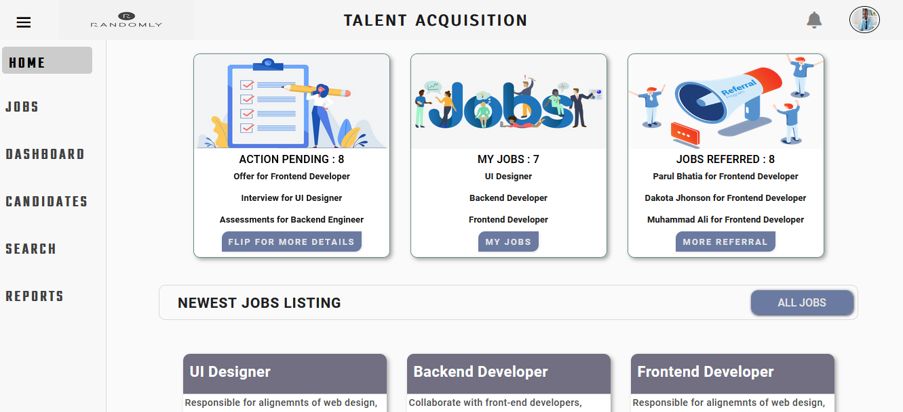
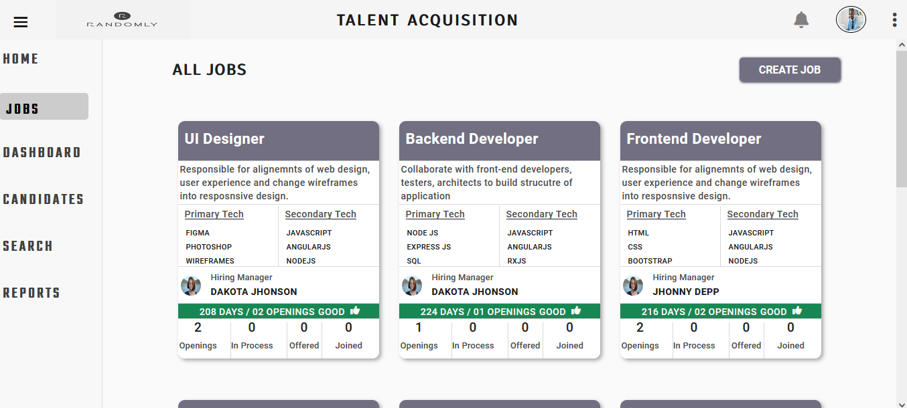
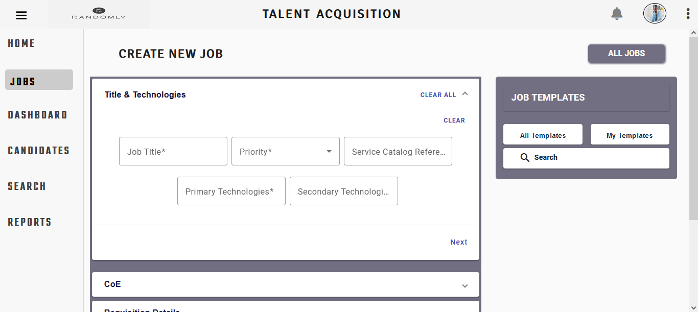
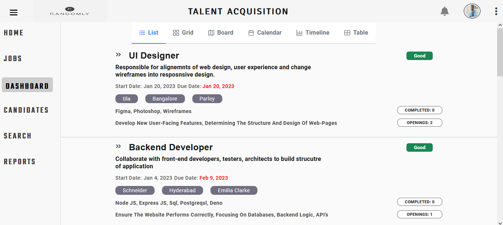
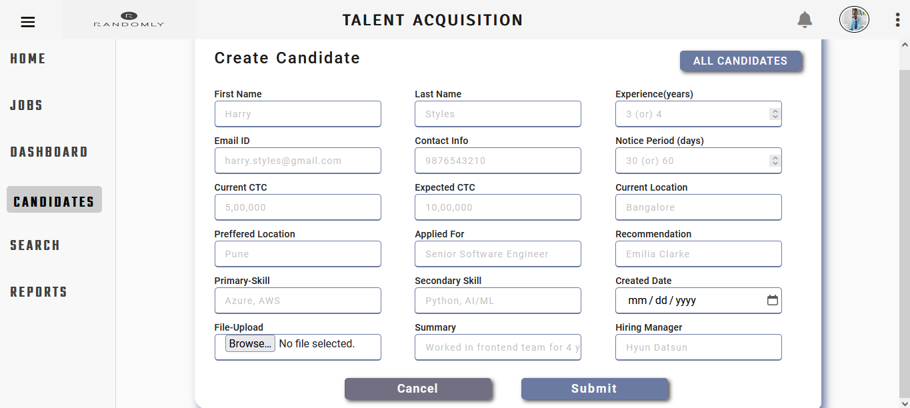
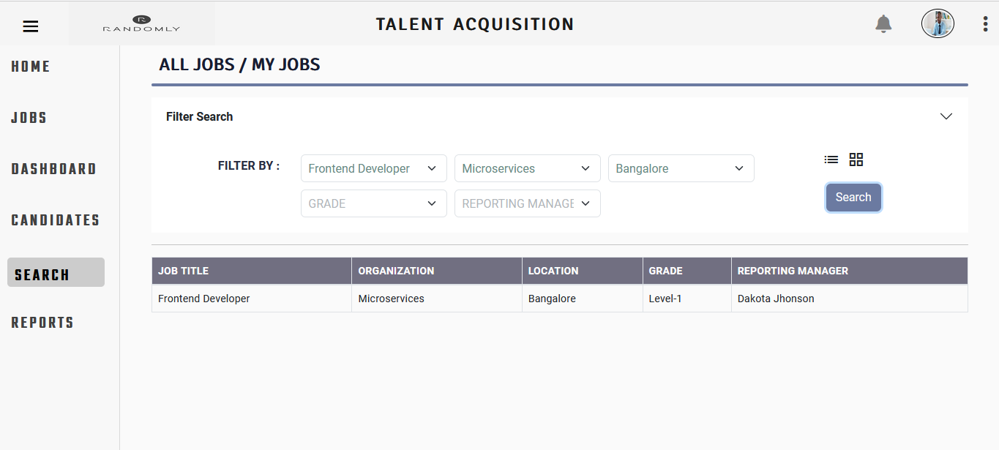
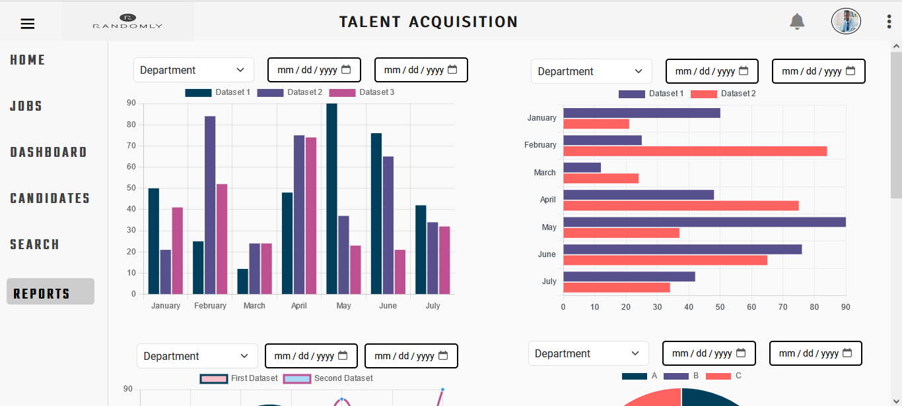

# Talent Acquisition Tool

The Talent Acuisition Tool is a comprehensive solution designed to streamline talent acquisition and human resources processes across the organization.

This application empowers HR professionals and acquisition teams to efficiently manage talent, from sourcing and recruitment to performance assessment and employee development.

## Key Features

* **Unified Talent Pipeline**: Centralize and manage potential candidates profiles, making it easy to track their progress through the hiring process.
* **Effortless Recruitment**: Streamline the recruitment workflow with automated job postings, candidate tracking, interview scheduling, and communication.
* **Performance Assessment**: Conduct fair and comprehensive employee evaluations, providing valuable insights for growth and improvement.
* **Skills Development**:  Identify skill gaps and offer personalized training plans to enhance employee skills and career progression.
* **Collaborative Workspace**: Foster teamwork by providing a collaborative platform for HR, managers, and employees to communicate, share documents, and set goals.
* **Data-Driven Insights**: Make informed decisions using real-time analytics and reports on recruitment metrics, employee performance, and more. 

## Dependencies

* **:electron: Angular**
* **:electron: Angular-Material**
* **:electron: FullCalendar**
* **:electron: Ag-Grid-Community**
* **:electron: ApexCharts**
* **:electron: SweetAlert2**

## Output

